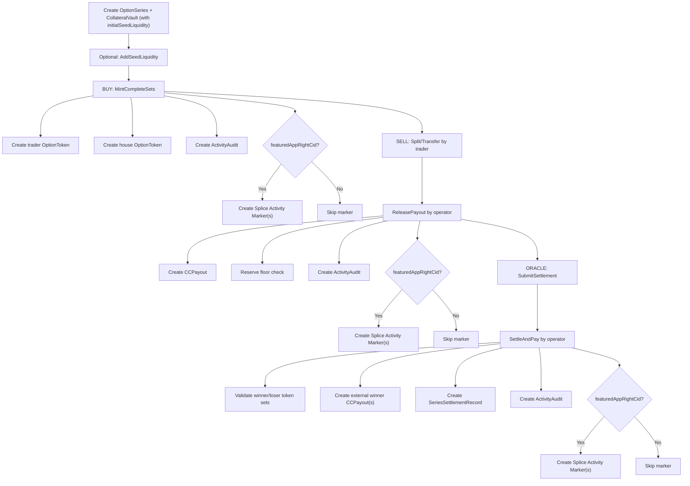
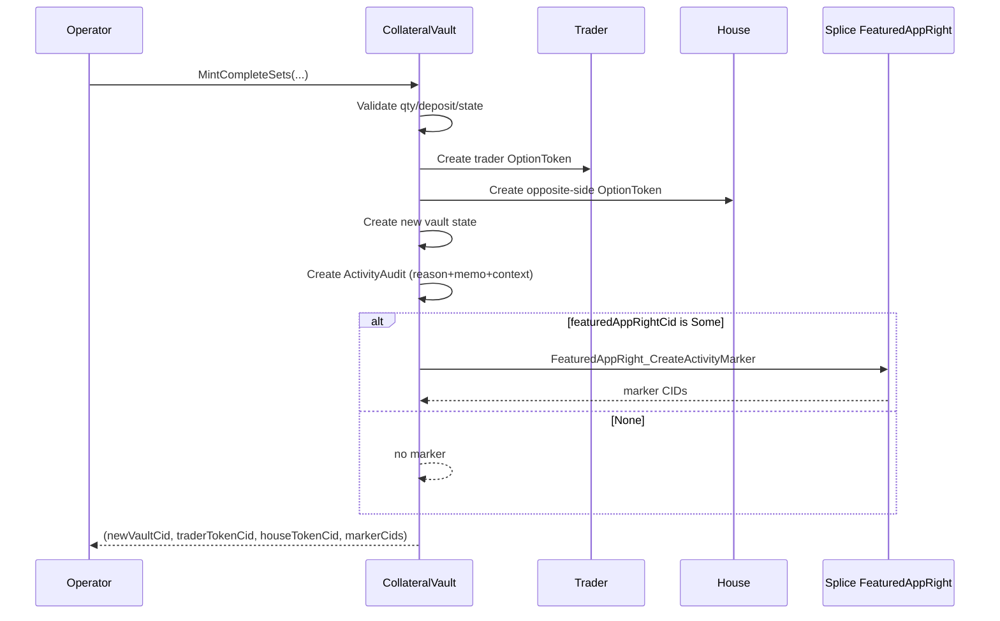

# Raven Contracts Functionality and Flow

This document explains each core function (template choice), what it does, and the flow.

## 1) OptionSeries functions

### `Activate`
- Controller: `operator`
- Purpose: moves series state into active trading.
- Effect: creates updated `OptionSeries` state.

### `EndTrading`
- Controller: `operator`
- Purpose: closes trading window before settlement.
- Effect: creates updated `OptionSeries` state.

### `SubmitSettlement`
- Controller: `oracle`
- Purpose: posts final resolved price and winning side (CALL/PUT).
- Effect: updates `OptionSeries.status = Settled` and stores settlement outcome.

### `Invalidate`
- Controller: `operator`
- Purpose: invalidates an unusable series.
- Effect: updates series status for off-chain handling.

## 2) CollateralVault functions

### `AddSeedLiquidity`
- Controller: `operator`
- Inputs: `amount`, `metadata`, `choiceContext`, `reason`, `featuredAppRightCid`
- Purpose:
  - adds seed collateral to existing series vault
  - updates `ccReserve` and `additionalSeedLiquidity`
  - records audit metadata
  - optionally creates Splice activity marker
- Returns:
  - new `CollateralVault` CID
  - marker CIDs

### `RemoveSeedLiquidity`
- Controller: `operator`
- Inputs: `amount`, `metadata`, `choiceContext`, `reason`, `featuredAppRightCid`
- Purpose:
  - removes only from `additionalSeedLiquidity`
  - keeps reserve above minted-set collateral floor
  - records audit metadata
  - optionally creates Splice activity marker
- Returns:
  - new `CollateralVault` CID
  - marker CIDs

### `MintCompleteSets`
- Controller: `operator`
- Inputs: `trader`, `desiredSide`, `quantity`, `depositAmount`, `metadata`, `choiceContext`, `reason`, `featuredAppRightCid`
- Purpose:
  - mints trader-side option tokens
  - mints opposite-side tokens to house
  - increases vault reserve
  - records audit metadata
  - optionally creates Splice activity marker
- Returns:
  - new `CollateralVault` CID
  - trader `OptionToken` CID
  - house `OptionToken` CID
  - marker CIDs (`[FeaturedAppActivityMarker]`)

### `ReleasePayout`
- Controller: `operator`
- Inputs: `trader`, `soldTokenCid`, `amount`, `reason`, `metadata`, `choiceContext`, `featuredAppRightCid`
- Purpose:
  - creates `CCPayout`
  - reduces reserve with collateral-floor check
  - validates sold token is already transferred to house
  - records lot sell event when token is linked to a lot
  - records audit metadata
  - optionally creates Splice activity marker
- Returns:
  - new `CollateralVault` CID
  - `CCPayout` CID
  - marker CIDs

### `SettleAndPay`
- Controller: `operator`
- Inputs: `seriesCid`, winner/loser token CIDs, `metadata`, `choiceContext`, `reason`, `featuredAppRightCid`
- Purpose:
  - validates settled series and side correctness
  - settles winner/loser tokens
  - creates external winner payouts
  - archives series and emits settlement record
  - records audit metadata
  - optionally creates Splice activity marker
- Returns:
  - `SeriesSettlementRecord` CID
  - payout CIDs
  - marker CIDs

## 3) OptionToken functions

### `Transfer`
- Controller: token `owner`
- Purpose: transfer token ownership.

### `Split`
- Controller: token `owner`
- Purpose: split position for partial sell/transfer.

### `SettleWinner`
- Controller: `operator`
- Purpose: settlement path for winning token.

### `SettleLoser`
- Controller: `operator`
- Purpose: settlement path for losing token.

## 4) PositionLot and PositionLotEvent

### `PositionLot`
- Created during `MintCompleteSets`.
- Stores original trade quantity per buy lot (`originalQuantity`) and owner metadata.

### `PositionLotEvent`
- Immutable lot event stream.
- Events created for:
  - mint (`LotEventMint`)
  - sell payout (`LotEventSell`)
  - settlement winner (`LotEventSettlementWin`)
  - settlement loser (`LotEventSettlementLoss`)

## 5) CCPayout function

### `Acknowledge`
- Controller: `recipient`
- Purpose: payout acknowledgement hook.

## 6) Marker + Memo metadata behavior

- Splice marker choice used: `FeaturedAppRight_CreateActivityMarker`.
- Memo/user metadata is captured in Raven audit as Splice-style metadata map:
  - `splice.lfdecentralizedtrust.org/reason`
  - `raven.market/external_user_id`
  - `raven.market/user_memo`
- `choiceContext` is carried and stored in `ActivityAudit` for backend traceability.

## 7) End-to-end flow diagram

## 8) Function-level sequence (MintCompleteSets)

## 9) Getter and storage map

DAML has no Solidity-style view getters. Read data by:
- querying active contracts by template
- fetching known CIDs
- reading transaction events (create/archive/exercise)

Main storage and what backend reads:
- `OptionSeries`: series metadata, status, settlement.
- `CollateralVault`: reserve state, seed accounting, minted-set totals.
- `OptionToken`: live remaining positions.
- `PositionLot`: original quantity per buy lot.
- `PositionLotEvent`: immutable quantity event timeline.
- `CCPayout`: payout entitlements + optional lot linkage.
- `SeriesSettlementRecord`: immutable settlement report.
- `ActivityAudit`: reason/memo/context audit records.

## 10) Team FAQ (short form)

### Is liquidity common across series?
No. Each series has its own vault/accounting.

### Do we need separate wallets for each series?
Not required. One treasury is fine, but reconciliation must stay series-scoped.

### How do we handle initial and additional seed?
Initial at vault create (`ccReserve` + `initialSeedLiquidity`), later via `AddSeedLiquidity`.
Withdrawals use `RemoveSeedLiquidity` and only from additional seed.

### Do we track original quantity and remaining quantity?
Yes. Original from `PositionLot`, remaining from active `OptionToken`.

### After `ReleasePayout`, do we audit and settle?
Yes. Ledger writes payout + audit (+ lot event). Off-chain processor performs actual payment settlement.

### Why does script fail with wallclock `setTime` error?
Because tests use `passTime`. Run both sandbox and script with `--static-time`.
