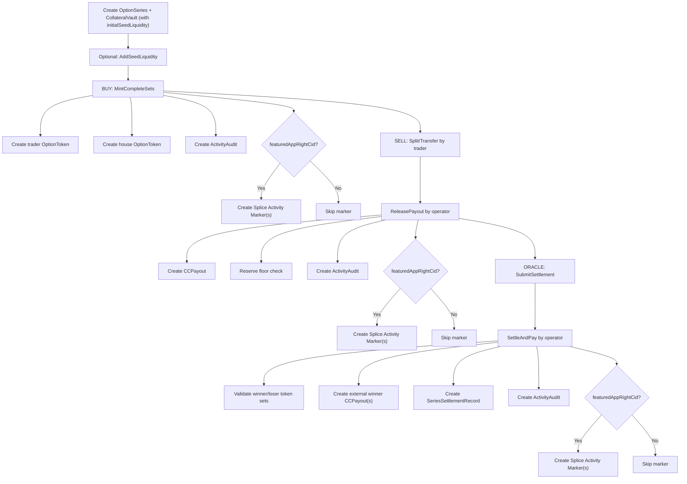
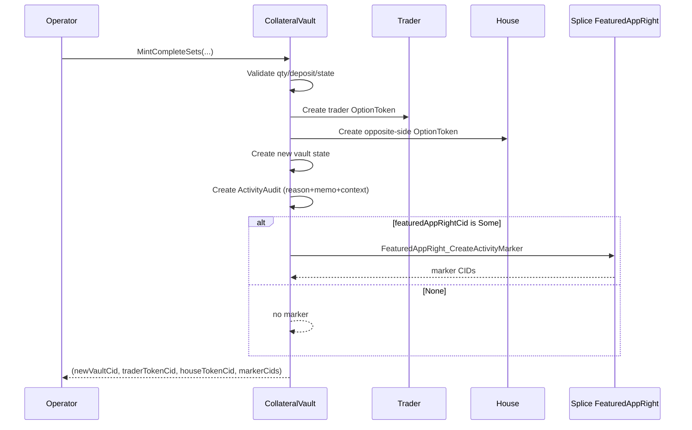
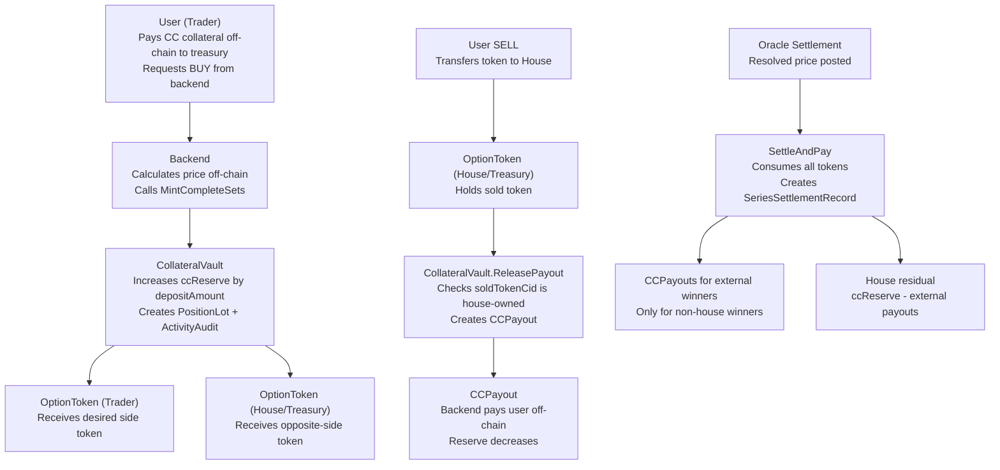

# Raven Contracts Functionality and Flow

This document explains each core function (template choice), what it does, and the flow.

## 1) OptionSeries functions

### `Activate`
- Controller: `operator`
- Purpose: moves series state into active trading.
- Effect: creates updated `OptionSeries` state.

### `EndTrading`
- Controller: `operator`
- Purpose: closes trading window before settlement.
- Effect: creates updated `OptionSeries` state.

### `SubmitSettlement`
- Controller: `oracle`
- Purpose: reads oracle price contract for resolved price and winning side (CALL/PUT) and records price update audit.
- Effect: updates `OptionSeries.status = Settled`, stores settlement outcome, emits optional activity marker and audit.

### `Invalidate`
- Controller: `operator`
- Purpose: invalidates an unusable series.
- Effect: updates series status for off-chain handling.

## 2) CollateralVault functions

### `AddSeedLiquidity`
- Controller: `operator`
- Inputs: `amount`, `metadata`, `choiceContext`, `reason`, `featuredAppRightCid`
- Purpose:
  - adds seed collateral to existing series vault
  - updates `ccReserve` and `additionalSeedLiquidity`
  - records audit metadata
  - optionally creates Splice activity marker
- Returns:
  - new `CollateralVault` CID
  - marker CIDs

### `RemoveSeedLiquidity`
- Controller: `operator`
- Inputs: `amount`, `metadata`, `choiceContext`, `reason`, `featuredAppRightCid`
- Purpose:
  - removes only from `additionalSeedLiquidity`
  - keeps reserve above minted-set collateral floor
  - records audit metadata
  - optionally creates Splice activity marker
- Returns:
  - new `CollateralVault` CID
  - marker CIDs

### `MintCompleteSets`
- Controller: `operator`
- Inputs: `trader`, `desiredSide`, `quantity`, `depositAmount`, `metadata`, `choiceContext`, `reason`, `featuredAppRightCid`
- Purpose:
  - mints trader-side option tokens
  - mints opposite-side tokens to house
  - increases vault reserve
  - records audit metadata
  - optionally creates Splice activity marker
- Returns:
  - new `CollateralVault` CID
  - trader `OptionToken` CID
  - house `OptionToken` CID
  - marker CIDs (`[FeaturedAppActivityMarker]`)

### `ReleasePayout`
- Controller: `operator`
- Inputs: `trader`, `soldTokenCid`, `amount`, `reason`, `metadata`, `choiceContext`, `featuredAppRightCid`
- Purpose:
  - creates `CCPayout`
  - reduces reserve with collateral-floor check
  - validates sold token is already transferred to house
  - records lot sell event when token is linked to a lot
  - records audit metadata
  - optionally creates Splice activity marker
- Returns:
  - new `CollateralVault` CID
  - `CCPayout` CID
  - marker CIDs

### `SettleAndPay`
- Controller: `operator`
- Inputs: `seriesCid`, winner/loser token CIDs, `metadata`, `choiceContext`, `reason`, `featuredAppRightCid`
- Purpose:
  - validates settled series and side correctness
  - settles winner/loser tokens
  - creates external winner payouts
  - archives series and emits settlement record
  - records audit metadata
  - optionally creates Splice activity marker
- Returns:
  - `SeriesSettlementRecord` CID
  - payout CIDs
  - marker CIDs

## 3) OptionToken functions

### `Transfer`
- Controller: token `owner`
- Purpose: transfer token ownership.

### `Split`
- Controller: token `owner`
- Purpose: split position for partial sell/transfer.

### `SettleWinner`
- Controller: `operator`
- Purpose: settlement path for winning token.

### `SettleLoser`
- Controller: `operator`
- Purpose: settlement path for losing token.

## 4) PositionLot and PositionLotEvent

### `PositionLot`
- Created during `MintCompleteSets`.
- Stores original trade quantity per buy lot (`originalQuantity`) and owner metadata.

### `PositionLotEvent`
- Immutable lot event stream.
- Events created for:
  - mint (`LotEventMint`)
  - sell payout (`LotEventSell`)
  - settlement winner (`LotEventSettlementWin`)
  - settlement loser (`LotEventSettlementLoss`)

## 5) CCPayout function

### `Acknowledge`
- Controller: `recipient`
- Purpose: payout acknowledgement hook.

## 6) Backend call snippets (exact choice arguments)

These snippets use the exact DAML choice argument names.
Transport/client library can differ, but payload fields must match these names.

Optional fields:
- `featuredAppRightCid`: pass contract-id or `None`/`null`.
- `choiceContext`: pass empty object/map when unused.

### 6.1 Series lifecycle calls

`SeriesOracle.UpdatePrice` (Chainlink report):

```json
{
  "contractId": "<seriesOracleCid>",
  "choice": "UpdatePrice",
  "argument": {
    "verifierCid": "<verifierCid>",
    "verifierConfigCid": "<verifierConfigCid>",
    "signedReportBytes": "<chainlink-signed-report-hex>",
    "metadata": {
      "externalUserId": "oracle-001",
      "userMemo": "price-update"
    },
    "choiceContext": { "values": {} },
    "reason": "PRICE_UPDATE",
    "featuredAppRightCid": "<featuredAppRightCid or null>"
  },
  "actingParties": ["<oracle>", "<operator>"]
}
```

`SeriesOracle.SetPrice` (manual override):

```json
{
  "contractId": "<seriesOracleCid>",
  "choice": "SetPrice",
  "argument": {
    "newPrice": "140.0",
    "metadata": {
      "externalUserId": "oracle-001",
      "userMemo": "price-update"
    },
    "choiceContext": { "values": {} },
    "reason": "PRICE_UPDATE",
    "featuredAppRightCid": "<featuredAppRightCid or null>"
  },
  "actingParties": ["<oracle>", "<operator>"]
}
```

`OptionSeries.Activate`:

```json
{
  "contractId": "<seriesCid>",
  "choice": "Activate",
  "argument": {},
  "actingParties": ["<operator>"]
}
```

`OptionSeries.EndTrading`:

```json
{
  "contractId": "<seriesCid>",
  "choice": "EndTrading",
  "argument": {},
  "actingParties": ["<operator>"]
}
```

`OptionSeries.SubmitSettlement`:

```json
{
  "contractId": "<seriesCid>",
  "choice": "SubmitSettlement",
  "argument": {
    "oraclePriceCid": "<seriesOracleCid>",
    "metadata": {
      "externalUserId": "oracle-001",
      "userMemo": "price-update"
    },
    "choiceContext": { "values": {} },
    "reason": "PRICE_UPDATE",
    "featuredAppRightCid": "<featuredAppRightCid or null>"
  },
  "actingParties": ["<oracle>"]
}
```

Note: if `featuredAppRightCid` is provided, the submit must include the featured app provider (usually `operator`) as an acting party because `FeaturedAppRight_CreateActivityMarker` is controlled by the provider.

`OptionSeries.Invalidate`:

```json
{
  "contractId": "<seriesCid>",
  "choice": "Invalidate",
  "argument": {
    "_reason": "MANUAL_INVALIDATION"
  },
  "actingParties": ["<operator>"]
}
```

### 6.2 Seed liquidity calls

`CollateralVault.AddSeedLiquidity`:

```json
{
  "contractId": "<vaultCid>",
  "choice": "AddSeedLiquidity",
  "argument": {
    "amount": "50.0",
    "metadata": {
      "externalUserId": "system-operator",
      "userMemo": "seed-topup-round-1"
    },
    "choiceContext": { "values": {} },
    "reason": "SEED_TOPUP",
    "featuredAppRightCid": "<featuredAppRightCid or null>"
  },
  "actingParties": ["<operator>"]
}
```

`CollateralVault.RemoveSeedLiquidity`:

```json
{
  "contractId": "<vaultCid>",
  "choice": "RemoveSeedLiquidity",
  "argument": {
    "amount": "10.0",
    "metadata": {
      "externalUserId": "system-operator",
      "userMemo": "seed-withdraw-round-1"
    },
    "choiceContext": { "values": {} },
    "reason": "SEED_WITHDRAW",
    "featuredAppRightCid": "<featuredAppRightCid or null>"
  },
  "actingParties": ["<operator>"]
}
```

### 6.3 Buy flow call

`CollateralVault.MintCompleteSets`:

```json
{
  "contractId": "<vaultCid>",
  "choice": "MintCompleteSets",
  "argument": {
    "trader": "<traderParty>",
    "desiredSide": "Call",
    "quantity": "10.0",
    "depositAmount": "12.0",
    "metadata": {
      "externalUserId": "user-alice-001",
      "userMemo": "buy-call-10"
    },
    "choiceContext": { "values": {} },
    "reason": "BUY_CALL_TRADE",
    "featuredAppRightCid": "<featuredAppRightCid or null>"
  },
  "actingParties": ["<operator>"]
}
```

### 6.4 Sell flow calls

`OptionToken.Split` (user side):

```json
{
  "contractId": "<userTokenCid>",
  "choice": "Split",
  "argument": {
    "splitQty": "5.0"
  },
  "actingParties": ["<tokenOwner>"]
}
```

`OptionToken.Transfer` (user side):

```json
{
  "contractId": "<splitTokenCidToSell>",
  "choice": "Transfer",
  "argument": {
    "newOwner": "<houseParty>"
  },
  "actingParties": ["<tokenOwner>"]
}
```

`CollateralVault.ReleasePayout` (operator side):

```json
{
  "contractId": "<vaultCid>",
  "choice": "ReleasePayout",
  "argument": {
    "trader": "<traderParty>",
    "soldTokenCid": "<tokenAlreadyTransferredToHouseCid>",
    "amount": "1.0",
    "reason": "SELL_PAYOUT",
    "metadata": {
      "externalUserId": "user-alice-001",
      "userMemo": "sell-call-5"
    },
    "choiceContext": { "values": {} },
    "featuredAppRightCid": "<featuredAppRightCid or null>"
  },
  "actingParties": ["<operator>"]
}
```

### 6.5 Settlement flow calls

`CollateralVault.SettleAndPay`:

```json
{
  "contractId": "<vaultCid>",
  "choice": "SettleAndPay",
  "argument": {
    "seriesCid": "<settledSeriesCid>",
    "winningTokenCids": ["<cid1>", "<cid2>", "<cid3>"],
    "losingTokenCids": ["<cid4>", "<cid5>"],
    "metadata": {
      "externalUserId": "system-operator",
      "userMemo": "finalize-series-001"
    },
    "choiceContext": { "values": {} },
    "reason": "SERIES_SETTLEMENT_FINALIZED",
    "featuredAppRightCid": "<featuredAppRightCid or null>"
  },
  "actingParties": ["<operator>"]
}
```

Important:
- `SettleWinner` / `SettleLoser` are exercised internally by `SettleAndPay`; backend should not call them directly in normal flow.

### 6.6 Daml Script form (reference-accurate)

When using Daml Script, same arguments look like:

```daml
submit operator do
  exerciseCmd vaultCid MintCompleteSets with
    trader = alice
    desiredSide = Call
    quantity = 10.0
    depositAmount = 12.0
    metadata = UserMetadata with
      externalUserId = Some "user-alice-001"
      userMemo = Some "buy-call-10"
    choiceContext = emptyChoiceContext
    reason = "BUY_CALL_TRADE"
    featuredAppRightCid = None
```

## 7) Marker + Memo metadata behavior

- Splice marker choice used: `FeaturedAppRight_CreateActivityMarker`.
- Memo/user metadata is captured in Raven audit as Splice-style metadata map:
  - `splice.lfdecentralizedtrust.org/reason`
  - `raven.market/external_user_id`
  - `raven.market/user_memo`
- `choiceContext` is carried and stored in `ActivityAudit` for backend traceability.

## 8) End-to-end flow diagram



## 9) Function-level sequence (MintCompleteSets)



## 10) Getter and storage map

DAML has no Solidity-style view getters. Read data by:
- querying active contracts by template
- fetching known CIDs
- reading transaction events (create/archive/exercise)

Main storage and what backend reads:
- `OptionSeries`: series metadata, status, settlement.
- `CollateralVault`: reserve state, seed accounting, minted-set totals.
- `OptionToken`: live remaining positions.
- `PositionLot`: original quantity per buy lot.
- `PositionLotEvent`: immutable quantity event timeline.
- `CCPayout`: payout entitlements + optional lot linkage.
- `SeriesSettlementRecord`: immutable settlement report.
- `ActivityAudit`: reason/memo/context audit records.

## 11) Team FAQ (short form)

### Is liquidity common across series?
No. Each series has its own vault/accounting.

### Do we need separate wallets for each series?
Not required. One treasury is fine, but reconciliation must stay series-scoped.

### How do we handle initial and additional seed?
Initial at vault create (`ccReserve` + `initialSeedLiquidity`), later via `AddSeedLiquidity`.
Withdrawals use `RemoveSeedLiquidity` and only from additional seed.

### Do we track original quantity and remaining quantity?
Yes. Original from `PositionLot`, remaining from active `OptionToken`.

### After `ReleasePayout`, do we audit and settle?
Yes. Ledger writes payout + audit (+ lot event). Off-chain processor performs actual payment settlement.

### Why does script fail with wallclock `setTime` error?
Because tests use `passTime`. Run both sandbox and script with `--static-time`.

## 12) Money Flow Diagram (Detailed)

House is the treasury party (`house`). It is a ledger party that represents your treasury wallet/account in the model.


